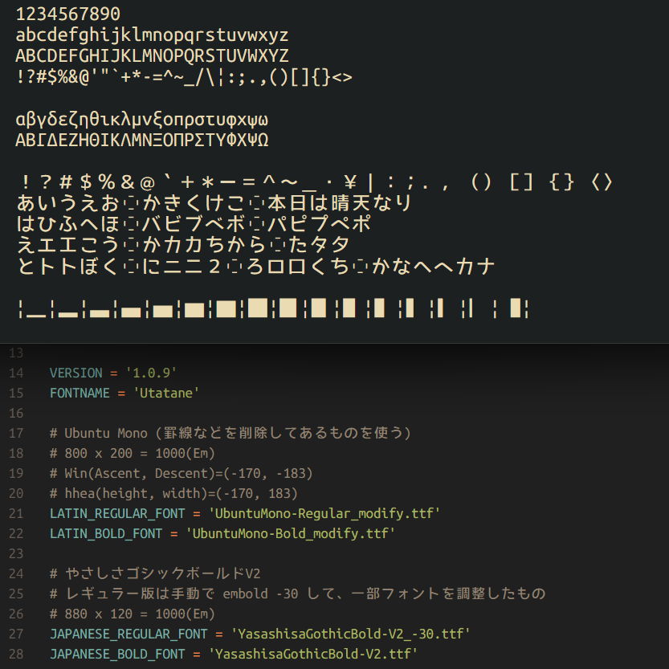

# プログラミング用フォント Yasashica



## ダウンロード

[リリースページ](https://github.com/nv-h/Yasashica/releases/latest)にビルド済みのフォントを配置しています。

## 概要

Ricty生成スクリプトをフォークして生成したプログラミング用の等幅フォント[Cica](https://github.com/miiton/Cica)からさらにフォークしたフォントです。
[Ubuntu Mono](http://font.ubuntu.com/) と
[やさしさゴシック](http://www.fontna.com/blog/379/) と [やさしさゴシックボールド](http://www.fontna.com/blog/736/) を合成して少し調整しています。

```
o Yasashica
|\
* * Ubuntu Mono
 \
  * やさしさゴシック
  |\
  | * IPA Fonts
  |\
  | * M+ FONTS
  |
  * やさしさゴシックボールド
   \
    * M+ FONTS
```

IPAフォントに置き換える場合 [IPAフォント](http://ossipedia.ipa.go.jp/ipafont/index.html) のページでIPAゴシックを入手してください。

## Rictyからの変更点

* 英数字に Ubutnu Mono を使用しています
* それ以外の文字に やさしさゴシック を使用しています
* 非HiDPI（非Retina）のWindowsでも文字が欠けません


## バリエーション

| ファイル名                  | 説明     |
| ----                        | ----     |
| Yasashica-Regular.ttf       | 通常     |
| Yasashica-Bold.ttf          | 太字     |

斜体はおかしくなるので未対応。

# ライセンス

* [LICENSE.txt](LICENSE.txt)

# 謝辞

Yasashicaフォントの合成にあたり[フォーク元のCicaフォント作成者](https://github.com/miiton)に感謝します。
また、以下の素晴らしいフォントを作成してくださった方々もありがとうございます。ありがたく使わせていただきます。

- [Ubuntu Font Family](http://font.ubuntu.com/)
- [やさしさゴシック](http://www.fontna.com/blog/379/)
- [やさしさゴシックボールド](http://www.fontna.com/blog/736/)
- [M\+ FONTS](https://mplus-fonts.osdn.jp/)
- [IPAフォント](http://ossipedia.ipa.go.jp/ipafont/index.html)